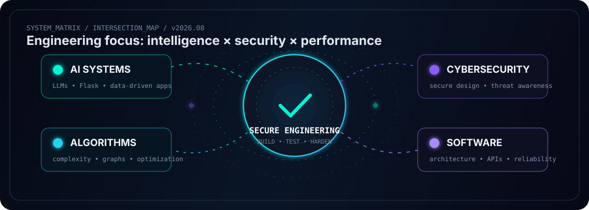

<!--
  PROFILE README — SEYID BERAT ERGÜN
  Theme: AI Systems × Cybersecurity × Software Engineering
  Repository: github.com/beratergun/beratergun
-->

<div align="center">
  

  <br />

  <a href="https://readme-typing-svg.demolab.com">
    
  </a>

  <p>
    <a href="https://github.com/beratergun?tab=followers"></a>
    <a href="https://www.linkedin.com/in/seyid-berat-erg%C3%BCn"></a>
    <a href="mailto:beratergun04@gmail.com"></a>
    
  </p>
</div>

---

## `0x00 // IDENTITY & MISSION`

<table>
<tr>
<td width="52%" valign="top">

### `OPERATOR_PROFILE`

```yaml
name: "Seyid Berat Ergün"
role: "Computer Engineering Student"
affiliation: "TED University"
location: "Ankara, Türkiye"
expected_graduation: "June 2027"
status: "Building in public"
```

</td>
<td width="48%" valign="top">

### `MISSION_PARAMETERS`

- Engineer **intelligent, reliable, and measurable** software systems.
- Apply **security-aware thinking** from architecture to validation.
- Turn learning into **visible, testable, well-documented** projects.
- Grow depth in **AI systems, cybersecurity, algorithms, and performance engineering**.

</td>
</tr>
</table>

<div align="center">
  
  
  
  
</div>

<table>
<tr>
<td width="25%" valign="top">

### `INTELLIGENCE_STACK`
- LLM systems
- AI engineering
- data-driven applications
- research to implementation

</td>
<td width="25%" valign="top">

### `SECURITY_STACK`
- secure architecture
- defensive programming
- validation mindset
- failure-path analysis

</td>
<td width="25%" valign="top">

### `ENGINEERING_STACK`
- algorithms
- APIs
- scalability
- maintainability

</td>
<td width="25%" valign="top">

### `SIGNAL_PROFILE`
- TEDU Cybersecurity Society member
- advanced / professional English
- Huawei cloud training completed
- leadership under pressure

</td>
</tr>
</table>

<div align="right">
  <sub><code>DISCIPLINE // CLARITY // EXECUTION</code></sub>
</div>

> I build software around three non-negotiable properties: **clarity, resilience, and measurable performance**.

<div align="center">
  
</div>

---

## `0x01 // CURRENT OPERATIONS`

<table>
<tr>
<td width="33%" valign="top">

### `AI.SYSTEMS`
Studying modern AI engineering through LLM systems, agents, retrieval-augmented generation, evaluation, guardrails, and production-minded architecture.

**Current objective:** convert research notes into small, testable builds rather than collecting passive resources.

</td>
<td width="33%" valign="top">

### `SECURITY.TRACK`
Developing a security-first mindset through secure design principles, vulnerability awareness, defensive programming, validation, and failure-path analysis.

**Current objective:** make threat modeling and input validation visible in project documentation and tests.

</td>
<td width="33%" valign="top">

### `ALGORITHM.CORE`
Strengthening data structures, graph algorithms, complexity analysis, problem-solving patterns, and performance trade-offs.

**Current objective:** publish explainable implementations with benchmarks, tests, and complexity notes.

</td>
</tr>
</table>

---

## `0x02 // FIELD EXPERIENCE`

### **Software Development Intern — Tusdata** · *Summer 2025 · Ankara, Türkiye*

> Cross-platform application development, API integration, structured debugging, validation, and performance-focused UI engineering.

- Developed cross-platform mobile application components using **Dart and Flutter**, with emphasis on modular interfaces and reusable widget architecture.
- Integrated frontend modules with backend services through **API-driven client–server communication**, structured data exchange, and consistent state handling.
- Applied scenario-based testing, structured debugging, system-level validation, and edge-case analysis to improve robustness.
- Optimized client-side data handling and rendering behavior under variable usage conditions.
- Translated **Figma-based UI/UX designs** into responsive, production-ready interfaces.
- Contributed to refactoring and structural improvements supporting maintainability and scalability.

<details>
<summary><b>View the engineering principles reinforced during the internship</b></summary>
<br />

```text
01. Modular UI structures reduce change cost.
02. API contracts must be explicit and validated.
03. Edge cases belong in the design process, not only in bug reports.
04. Responsiveness is an engineering requirement, not visual polish.
05. Refactoring is valuable when it improves clarity, testability, or change safety.
```

</details>

---

## `0x03 // PROJECT OPERATIONS`

<table>
<tr>
<td width="50%" valign="top">

### 🛡️ **PassGuard**
`CS50x CAPSTONE // SECURITY-FOCUSED FULL-STACK APP`

A password-strength analysis platform built with **Python, Flask, SQLite, HTML, CSS, and JavaScript**. The project combines server-side routing, persistent analysis history, dynamic security scoring, and state-aware frontend behavior.

**Engineering signals**
- Backend routing and database integration
- Real-time security feedback
- Persistent analysis history
- Responsive interface and theme state

[**ACCESS PROJECT PORTFOLIO →**](https://github.com/beratergun/Cs50-Portfolio)

</td>
<td width="50%" valign="top">

### 🤖 **AI Engineering Knowledge Base**
`RESEARCH INDEX // AI SYSTEMS // AGENTS // RAG // EVALUATION`

A curated engineering map of books, papers, courses, frameworks, and practical references for building modern AI systems.

**Engineering signals**
- AI engineering and system design
- Agents and orchestration patterns
- Retrieval-augmented generation
- Evaluation, guardrails, and deployment thinking

[**OPEN KNOWLEDGE BASE →**](https://github.com/beratergun/artificial-intelligence)

</td>
</tr>
<tr>
<td width="50%" valign="top">

### 🕸️ **MST Graph Optimizer**
`ALGORITHMS // PYTHON // GRAPH THEORY`

An academic algorithmic tool implementing **Prim's and Kruskal's algorithms** to process graph datasets and compute Minimum Spanning Trees with time–space efficiency in mind.

**Planned repository hardening**
- Add deterministic test datasets
- Compare algorithmic behavior
- Document complexity and trade-offs
- Publish benchmark output

`STATUS: documentation and public release in progress`

</td>
<td width="50%" valign="top">

### 🛒 **E-Commerce Architecture**
`TEAM SOFTWARE PROJECT // INTEGRATION // SCALABLE INTERACTIONS`

A five-person agile project focused on backend–frontend integration, maintainable architecture, collaborative delivery, and scalable user interactions.

**Engineering signals**
- Team-based delivery
- Backend–frontend integration
- Object-oriented design
- Maintainability and scalability

`STATUS: academic team project`

</td>
</tr>
</table>


---

## `0x04 // TECHNICAL ARSENAL`

### `LANGUAGES & APPLICATION STACK`

<p align="center">
  
</p>

<div align="center">
  
  
  
  
  
  
</div>

### `TOOLS, PLATFORMS & WORKFLOW`

<p align="center">
  
</p>

<div align="center">
  
  
  
  
</div>

<details>
<summary><b>Expand complete capability matrix</b></summary>
<br />

| Domain | Capabilities |
|---|---|
| **Algorithms** | Algorithm design, complexity analysis, data structures, graph algorithms, optimization thinking |
| **Architecture** | Object-oriented design, modularity, backend–frontend integration, API-driven communication |
| **Quality Engineering** | Structured debugging, scenario-based testing, validation, edge-case analysis, maintainability |
| **Secure Engineering** | Secure design principles, defensive programming awareness, input validation, failure-path thinking |
| **Performance** | Client-side data handling, rendering responsiveness, scalability and maintainability principles |
| **Hardware / Digital** | VHDL, digital logic, FPGA-oriented design with Xilinx ISE, Arduino fundamentals |
| **Collaboration** | Agile team delivery, technical communication, peer problem solving, mentoring and leadership |

</details>

---

## `0x05 // SECURITY DOCTRINE`

```text
[01] DEFINE TRUST BOUNDARIES
[02] MINIMIZE ATTACK SURFACE
[03] VALIDATE INPUTS AND ASSUMPTIONS
[04] MODEL FAILURE BEFORE DEPLOYMENT
[05] TEST EDGE CASES, NOT ONLY HAPPY PATHS
[06] PROTECT DATA THROUGHOUT ITS LIFECYCLE
[07] LOG WITH PURPOSE — NEVER LEAK SECRETS
[08] PATCH, REVIEW, MEASURE, REPEAT
```

- Active member of the **TEDU Cybersecurity Society** since 2023.
- Participated in structured workshops on secure system architecture and vulnerability assessment.
- Contributed to peer-level discussions on algorithmic security reasoning and defensive programming practices.
- Developing practical depth by connecting security concepts to architecture, testing, validation, and documentation.

> **Security is not a final checklist. It is a design constraint carried through the entire engineering lifecycle.**

---

## `0x06 // CERTIFICATION VAULT`

| Issuer | Program | Completed |
|---|---|:---:|
| **The Hong Kong University of Science and Technology** | Software Engineering: Implementation and Testing | May 2026 |
| **The Hong Kong University of Science and Technology** | Software Engineering: Software Design and Project Management | May 2026 |
| **The Hong Kong University of Science and Technology** | Software Engineering: Modeling Software Systems using UML | May 2026 |
| **Harvard University** | CS50x — Introduction to Computer Science | Apr 2026 |
| **Advanced Algorithms Training** | Java Data Structures & Algorithms + LeetCode Exercises | Mar 2026 |
| **Huawei** | Cloud Developer Training Program | Dec 2025 |
| **Universidad de Palermo** | Object-Oriented Programming with Java | Nov 2024 |
| **Princeton University** | Computer Science: Programming with a Purpose | Oct 2024 |
| **TED University** | Academic Production and Institutional Processes with Artificial Intelligence | Completed |

---

## `0x07 // ENGINEERING TELEMETRY`

<div align="center">
  
</div>

<div align="center">
  <sub><code>REPO-LOCAL VISUAL // NO EXTERNAL GITHUB-STATS CARD DEPENDENCY</code></sub>
</div>

<table>
<tr>
<td width="25%" align="center"><b>AI SYSTEMS</b><br><sub>Research → Prototype</sub></td>
<td width="25%" align="center"><b>CYBERSECURITY</b><br><sub>Model → Validate</sub></td>
<td width="25%" align="center"><b>ALGORITHMS</b><br><sub>Analyze → Optimize</sub></td>
<td width="25%" align="center"><b>RELIABILITY</b><br><sub>Test → Harden</sub></td>
</tr>
</table>

## `0x08 // LEADERSHIP & TECH COMMUNITY`

### **Radio TEDU — Technical Team Member**

- Contribute to the technical side of campus broadcasting and media operations.
- Support the infrastructure and workflow behind digital audio production.
- Explore the intersection of communication technology, technical coordination, and engineering discipline.

### **Competitive Table Tennis — Team Captain** · *2015–2023*

- Led team coordination and strategic preparation during regional competitions.
- Achieved **first-place rankings in Ankara regional tournaments**.
- Mentored junior teammates and supported match-planning strategies.
- Developed disciplined decision-making under pressure, performance resilience, and long-term training consistency.

These habits transfer directly into engineering: **prepare deliberately, measure performance, stay composed under failure, and improve through repetition**.

---

## `0x09 // COMMUNICATION CHANNELS`

<div align="center">
  <a href="https://www.linkedin.com/in/seyid-berat-erg%C3%BCn">
    
  </a>
  <a href="mailto:beratergun04@gmail.com">
    
  </a>
  <a href="https://github.com/beratergun">
    
  </a>
</div>

<br />

<div align="center">
  <code>BUILD → TEST → HARDEN → MEASURE → ITERATE</code>
  <br /><br />
  <sub>Engineered with curiosity, discipline, and a security-aware mindset.</sub>
</div>
