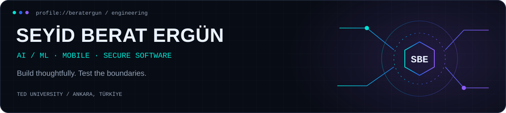
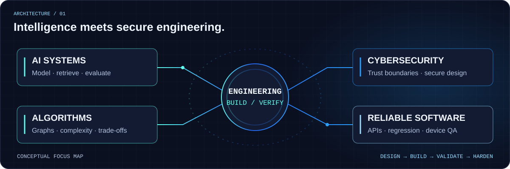
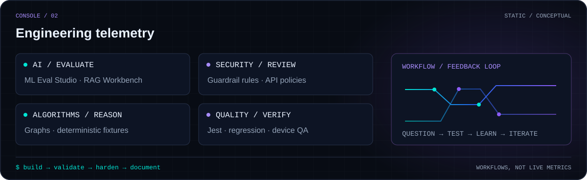

<!--
  Seyid Berat Ergün · Engineering Portfolio
  Maintained at github.com/beratergun/beratergun
  Repository-local static SVG graphics. No embedded scripts, fake metrics, or unverified production claims.
-->

## `0x00 // IDENTITY`

  
   
  <strong>Computer Engineering · TED University</strong> 
  AI / ML &nbsp;•&nbsp; Mobile Engineering &nbsp;•&nbsp; Cybersecurity &nbsp;•&nbsp; Software Quality
    
  
  
  

---

**Seyid Berat Ergün** — 4th-year Computer Engineering student at **TED University**, Ankara. 
Building cross-platform products, exploring applied AI/ML and strengthening software through testing and security-aware design.

**Currently working on:** **RadioTEDU** · **[berXfit](https://github.com/beratergun/berXfit)** · **PerDrobe**

## `0x01 // ENGINEERING EXPERIENCE`

### RadioTEDU · Technical Team / Mobile Engineering
2026–Present · React Native · TypeScript · Android / iOS

- Playback, channel switching, navigation and platform-specific fixes.
- API-integrated profile, authentication and notification features.
- Jest regression checks, device QA, issue tracking and release checks.

### TPIC · Information Technologies Intern
Aug–Sep 2026 · Enterprise IT · Controlled technical exercises

- Corporate IT workflows, infrastructure investigations and documentation.
- Validation of access boundaries, error handling and reliability.

### Tusdata · Software Development Intern
Summer 2025 · Flutter · Dart · REST APIs

- Responsive components adapted from Figma designs.
- API integration, debugging and reusable UI structure.

Work is described at its actual stage: development, laboratory prototyping or QA; not all features are released. Employer-internal systems remain private.

## `0x02 // SELECTED PROJECTS`

<table>
<tr>
<td valign="top" width="50%">
<b><a href="https://github.com/beratergun/berXfit">berXfit</a></b> &nbsp; PRODUCT / PUBLIC RELEASE 
TypeScript · React · PWA / Android  
Local-first fitness and nutrition app. Workout logs, offline storage, progress tracking and data export.  
<a href="https://github.com/beratergun/berXfit">Code & releases ↗</a> · <a href="https://beratergun.github.io/berXfit/">Web app ↗</a>
</td>
<td valign="top" width="50%">
<b>PerDrobe</b> &nbsp; UNIVERSITY CAPSTONE 
AI / ML · Recommendation Systems  
In-progress fit, size and style recommendation project with wardrobe and multi-brand discovery concepts.  
CMPE 491–492 · 2026–27
</td>
</tr>
<tr>
<td valign="top">
<b><a href="https://github.com/beratergun/Cs50-Portfolio">PassGuard</a></b> &nbsp; CS50x ACADEMIC PROJECT 
Python · Flask · SQLite  
Password-strength analysis with assessment history and persistent UI preferences. Course solution code remains private.  
<a href="https://github.com/beratergun/Cs50-Portfolio">Project overview ↗</a>
</td>
<td valign="top">
<b><a href="https://github.com/beratergun/llm-guardrail-studio">LLM Guardrail Studio</a></b> &nbsp; SECURITY LAB 
Python · Local-first  
Explainable rule-based checks for prompt-injection patterns and sensitive-text review.  
<a href="https://github.com/beratergun/llm-guardrail-studio">View repository ↗</a>
</td>
</tr>
</table>

<b>More projects — explore the code</b>

 

| Project | Technical focus |
|:--|:--|
| [RAG Eval Workbench](https://github.com/beratergun/rag-eval-workbench) | Retrieval metrics · evaluation fixtures |
| [Graph Optimizer Lab](https://github.com/beratergun/graph-optimizer-lab) | Prim · Kruskal · deterministic tests |
| [ML Eval Studio](https://github.com/beratergun/ml-eval-studio) | Classifier metrics · thresholds · calibration · deterministic tests |
| [Secure API Policy Lab](https://github.com/beratergun/secure-api-policy-lab) | API security · access-control policy |
| [Model Drift Monitor](https://github.com/beratergun/model-drift-monitor) | Model / data drift experiments |
| [AI Knowledge Base](https://github.com/beratergun/artificial-intelligence) | Papers · agents · RAG · evaluation resources |
| [SBE Portfolio](https://sberatergun.com) | Personal website · technical writing |

[**Browse all repositories ↗**](https://github.com/beratergun?tab=repositories)

## `0x03 // ENGINEERING SYSTEM MATRIX`

## `0x04 // TECHNICAL STACK`

- **Languages:** TypeScript / JavaScript, Python, Java, Dart, C, SQL, VHDL.
- **Mobile:** React Native, Flutter, Android / iOS, state management.
- **Backend & web:** REST APIs, Node.js / Express, PostgreSQL, MySQL, HTML / CSS; ASP.NET Core exposure.
- **AI / ML:** Model evaluation, local models, RAG, algorithms and data structures.
- **Quality & security:** Jest, TypeScript checks, regression tests, secure design.
- **Tools:** Git / GitHub, VS Code, Android Studio, Figma.

## `0x05 // COMMUNITIES & LEADERSHIP`

| Community | Role |
|:--|:--|
| **RadioTEDU** | Technical team · mobile application |
| **TEDU Google developer community** | Technical & organization teams |
| **TEDU Chess Club** | Design team |
| **TEDU Cybersecurity Society** | Member since 2023 · security learning |
| **Competitive Table Tennis** | Team captain · 2015–2023; Ankara regional first-place results, junior mentoring |

## `0x06 // EDUCATION & CERTIFICATIONS`

**TED University** — B.Sc. Computer Engineering (in progress; expected June 2027)

<b>Certificates & additional training</b>

 

- **Harvard University** — CS50x, Introduction to Computer Science (April 2026)
- **HKUST** — Software Engineering: Implementation & Testing; Software Design & Project Management; UML Modeling (May 2026)
- **Huawei** — Cloud Developer Training Program (December 2025)
- **Princeton University** — Computer Science: Programming with a Purpose (October 2024)
- **Universidad de Palermo** — Object-Oriented Programming with Java (November 2024)
- **Additional training** — Java Data Structures & Algorithms + LeetCode Exercises (March 2026)
- **TED University** — Academic Production and Institutional Processes with Artificial Intelligence

## `0x07 // ENGINEERING TELEMETRY`

## `0x08 // CONTACT`

  <a href="mailto:beratergun04@gmail.com">beratergun04@gmail.com</a> · Ankara, Türkiye 
  <code>THINK CLEARLY  /  BUILD DELIBERATELY  /  TEST THE EDGE CASES</code> 
  <a href="https://sberatergun.com">sberatergun.com</a> &nbsp;·&nbsp; <a href="https://github.com/beratergun?tab=repositories">repositories</a> &nbsp;·&nbsp; <a href="https://www.linkedin.com/in/seyid-berat-erg%C3%BCn/">LinkedIn</a>

